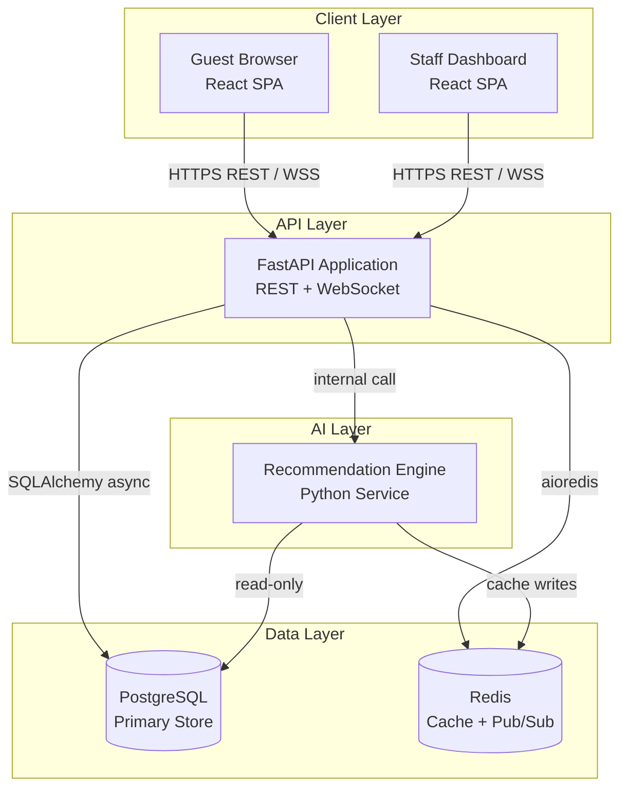
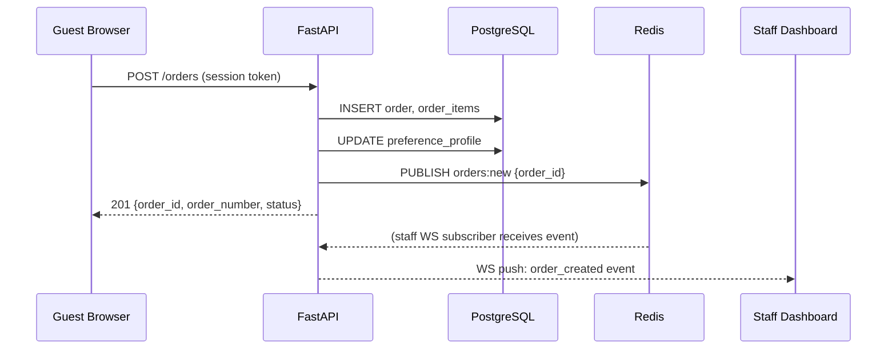
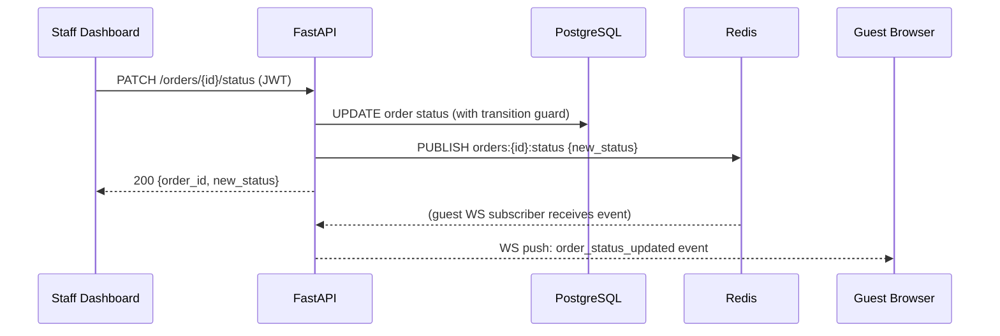
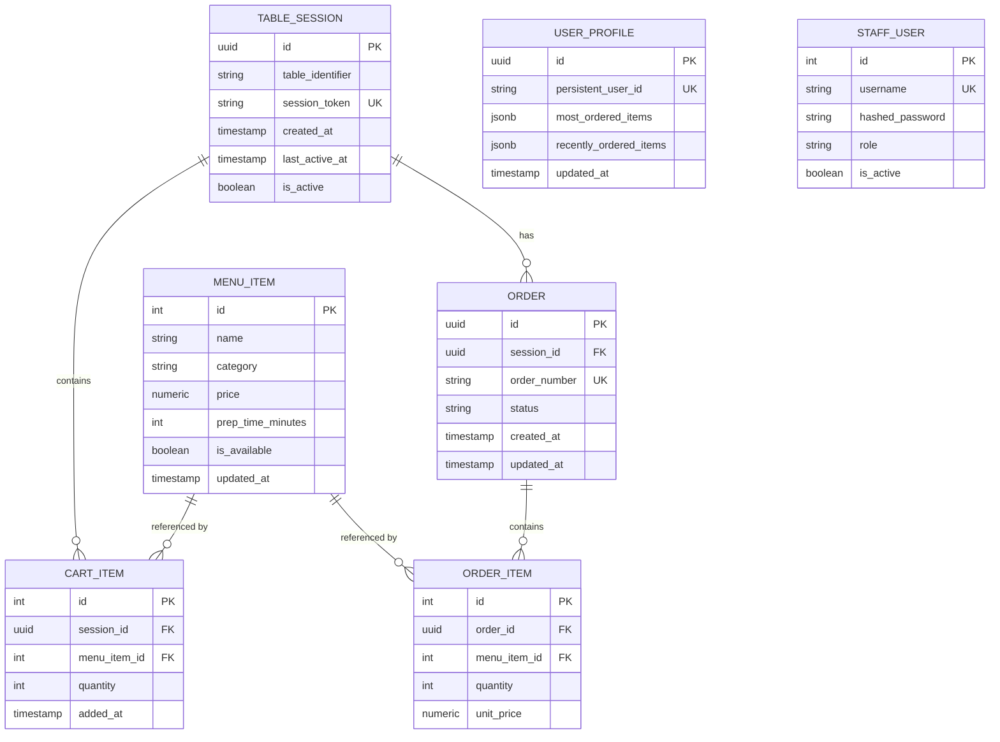
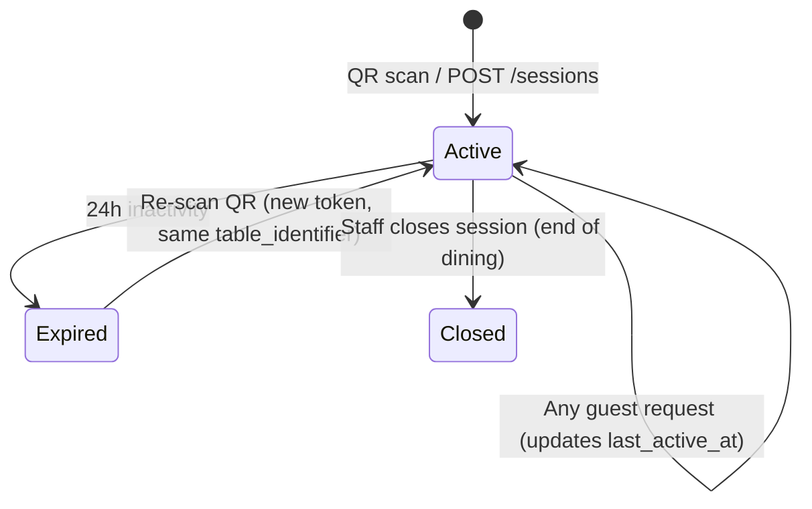

# Design Document

## Smart Restaurant Ordering System

---

## Overview

The Smart Restaurant Ordering System is a full-stack web application that enables restaurant guests to scan a QR code, browse a digital menu, manage a cart, place orders, and track order status in real time. Staff access a dedicated dashboard to manage incoming orders and update their lifecycle. An AI-powered recommendation engine personalizes suggestions based on per-user preference profiles.

### Key Design Goals

- **Real-time consistency**: Order status changes propagate to all connected clients within 2 seconds via WebSockets.
- **Session durability**: Table sessions, carts, and order history survive page reloads and device switches.
- **Stateless API + stateful WebSocket**: REST endpoints handle CRUD; WebSocket channels handle push notifications.
- **Pluggable recommendation engine**: The AI layer is isolated behind a clean interface so the algorithm can evolve independently.
- **Role-based access**: Staff endpoints are protected by JWT authentication; guest endpoints are protected by session tokens only.

### Technology Choices

| Layer | Technology | Rationale |
|---|---|---|
| Backend API | FastAPI (Python 3.11+) | Async-native, automatic OpenAPI docs, excellent WebSocket support |
| Database | PostgreSQL 15 | ACID transactions, JSONB for flexible profile storage, mature ecosystem |
| ORM | SQLAlchemy 2.0 (async) | Type-safe models, async session support |
| Migrations | Alembic | Schema versioning alongside SQLAlchemy |
| Real-time | FastAPI WebSockets + Redis Pub/Sub | Fan-out across multiple server instances |
| Cache / Broker | Redis 7 | Session token lookup, pub/sub, recommendation cache |
| Frontend | React 18 + TypeScript | Component model suits menu/cart/order UI; large ecosystem |
| Auth (Staff) | JWT (python-jose) + bcrypt | Stateless, standard, easy to validate in middleware |
| Recommendation | Collaborative filtering (scikit-learn) + rule-based fallback | Lightweight, no external AI dependency required |
| Containerization | Docker Compose | Local dev parity; easy to extend to Kubernetes |

---

## Architecture

### High-Level Component Diagram



### Request Flow: Guest Places an Order



### Request Flow: Staff Updates Order Status



---

## Components and Interfaces

### Backend Modules

```
app/
├── main.py                  # FastAPI app factory, router registration
├── config.py                # Settings (pydantic-settings)
├── database.py              # Async SQLAlchemy engine + session factory
├── redis_client.py          # aioredis connection pool
│
├── routers/
│   ├── sessions.py          # QR scan, session creation/resumption
│   ├── menu.py              # Menu browsing, staff menu management
│   ├── cart.py              # Cart CRUD
│   ├── orders.py            # Order placement, status updates
│   ├── auth.py              # Staff login, token refresh
│   └── ws.py                # WebSocket connection manager
│
├── models/                  # SQLAlchemy ORM models
│   ├── table_session.py
│   ├── menu_item.py
│   ├── cart.py
│   ├── order.py
│   └── user_profile.py
│
├── schemas/                 # Pydantic request/response schemas
│   ├── session.py
│   ├── menu.py
│   ├── cart.py
│   ├── order.py
│   └── recommendation.py
│
├── services/
│   ├── session_service.py   # Session token generation, validation
│   ├── order_service.py     # Order creation, status transitions
│   ├── cart_service.py      # Cart mutation logic
│   └── menu_service.py      # Menu CRUD, availability broadcast
│
├── recommendation/
│   ├── engine.py            # RecommendationEngine interface
│   ├── collaborative.py     # Collaborative filtering implementation
│   └── fallback.py          # Popularity-based fallback
│
└── middleware/
    ├── auth.py              # JWT validation for staff routes
    └── session.py           # Session token validation for guest routes
```

### WebSocket Connection Manager

The `ConnectionManager` class maintains in-process subscriber maps and delegates fan-out to Redis Pub/Sub for multi-instance deployments.

```python
class ConnectionManager:
    # guest_connections: dict[session_id, list[WebSocket]]
    # staff_connections: list[WebSocket]

    async def connect_guest(session_id: str, ws: WebSocket) -> None
    async def connect_staff(ws: WebSocket) -> None
    async def disconnect(ws: WebSocket) -> None
    async def broadcast_to_session(session_id: str, event: dict) -> None
    async def broadcast_to_staff(event: dict) -> None
    async def broadcast_order_status(order_id: str, new_status: str) -> None
```

### Recommendation Engine Interface

```python
class RecommendationEngine(Protocol):
    async def get_recommendations(
        profile: PreferenceProfile,
        cart_item_ids: list[int],
        available_item_ids: list[int],
        limit: int = 5,
    ) -> list[RecommendedItem]: ...
```

Two implementations:
- `CollaborativeEngine`: Uses item-item similarity matrix built from order history.
- `PopularityEngine`: Ranks by global order frequency; used as fallback when profile is empty.

The active engine is selected at startup via config and injected via FastAPI dependency injection.

---

## Data Models

### Entity Relationship Diagram



### PostgreSQL Schema (DDL)

```sql
-- Table sessions
CREATE TABLE table_sessions (
    id              UUID PRIMARY KEY DEFAULT gen_random_uuid(),
    table_identifier VARCHAR(64) NOT NULL,
    session_token   VARCHAR(128) UNIQUE NOT NULL,
    persistent_user_id VARCHAR(128),          -- survives session changes
    created_at      TIMESTAMPTZ NOT NULL DEFAULT now(),
    last_active_at  TIMESTAMPTZ NOT NULL DEFAULT now(),
    is_active       BOOLEAN NOT NULL DEFAULT TRUE
);
CREATE INDEX idx_sessions_token ON table_sessions(session_token);
CREATE INDEX idx_sessions_table ON table_sessions(table_identifier);

-- Menu items
CREATE TABLE menu_items (
    id              SERIAL PRIMARY KEY,
    name            VARCHAR(255) NOT NULL,
    category        VARCHAR(128) NOT NULL,
    price           NUMERIC(10,2) NOT NULL CHECK (price > 0),
    prep_time_minutes INT NOT NULL CHECK (prep_time_minutes > 0),
    is_available    BOOLEAN NOT NULL DEFAULT TRUE,
    updated_at      TIMESTAMPTZ NOT NULL DEFAULT now()
);

-- Cart items (per session)
CREATE TABLE cart_items (
    id              SERIAL PRIMARY KEY,
    session_id      UUID NOT NULL REFERENCES table_sessions(id) ON DELETE CASCADE,
    menu_item_id    INT NOT NULL REFERENCES menu_items(id),
    quantity        INT NOT NULL CHECK (quantity > 0),
    added_at        TIMESTAMPTZ NOT NULL DEFAULT now(),
    UNIQUE (session_id, menu_item_id)
);

-- Orders
CREATE TABLE orders (
    id              UUID PRIMARY KEY DEFAULT gen_random_uuid(),
    session_id      UUID NOT NULL REFERENCES table_sessions(id),
    order_number    VARCHAR(32) UNIQUE NOT NULL,
    status          VARCHAR(32) NOT NULL DEFAULT 'Received'
                        CHECK (status IN ('Received','Cooking','Ready','Delivered')),
    created_at      TIMESTAMPTZ NOT NULL DEFAULT now(),
    updated_at      TIMESTAMPTZ NOT NULL DEFAULT now()
);
CREATE INDEX idx_orders_session ON orders(session_id);
CREATE INDEX idx_orders_status ON orders(status);

-- Order items (snapshot of price at time of order)
CREATE TABLE order_items (
    id              SERIAL PRIMARY KEY,
    order_id        UUID NOT NULL REFERENCES orders(id) ON DELETE CASCADE,
    menu_item_id    INT NOT NULL REFERENCES menu_items(id),
    quantity        INT NOT NULL CHECK (quantity > 0),
    unit_price      NUMERIC(10,2) NOT NULL CHECK (unit_price > 0)
);

-- User preference profiles
CREATE TABLE user_profiles (
    id                  SERIAL PRIMARY KEY,
    persistent_user_id  VARCHAR(128) UNIQUE NOT NULL,
    most_ordered_items  JSONB NOT NULL DEFAULT '[]',   -- [{item_id, count}] top 5
    recently_ordered_items JSONB NOT NULL DEFAULT '[]', -- [item_id] last 10
    updated_at          TIMESTAMPTZ NOT NULL DEFAULT now()
);

-- Staff users
CREATE TABLE staff_users (
    id              SERIAL PRIMARY KEY,
    username        VARCHAR(128) UNIQUE NOT NULL,
    hashed_password VARCHAR(255) NOT NULL,
    role            VARCHAR(32) NOT NULL DEFAULT 'staff',
    is_active       BOOLEAN NOT NULL DEFAULT TRUE
);
```

### Pydantic Schemas (Key Examples)

```python
# Session
class SessionCreateResponse(BaseModel):
    session_id: UUID
    session_token: str
    table_identifier: str

# Menu
class MenuItemResponse(BaseModel):
    id: int
    name: str
    category: str
    price: Decimal
    prep_time_minutes: int
    is_available: bool

# Cart
class CartItemAdd(BaseModel):
    menu_item_id: int
    quantity: int = 1

class CartResponse(BaseModel):
    items: list[CartItemDetail]
    total_price: Decimal

# Order
class OrderResponse(BaseModel):
    id: UUID
    order_number: str
    status: Literal["Received", "Cooking", "Ready", "Delivered"]
    items: list[OrderItemDetail]
    estimated_wait_minutes: int
    created_at: datetime

# Preference Profile
class PreferenceProfile(BaseModel):
    persistent_user_id: str
    most_ordered_items: list[OrderedItemCount]  # [{item_id, count}]
    recently_ordered_items: list[int]           # [item_id], max 10
    updated_at: datetime

    model_config = ConfigDict(from_attributes=True)

class OrderedItemCount(BaseModel):
    item_id: int
    count: int
```

---

## API Design

### Base URL: `/api/v1`

### Guest Endpoints (Session Token Auth via `X-Session-Token` header)

| Method | Path | Description |
|---|---|---|
| `POST` | `/sessions` | Create or resume a table session from QR code |
| `GET` | `/sessions/{session_id}` | Get full session state (cart + orders) |
| `GET` | `/menu` | List all menu items grouped by category |
| `GET` | `/cart` | Get current cart for session |
| `POST` | `/cart/items` | Add item to cart |
| `PATCH` | `/cart/items/{item_id}` | Update item quantity |
| `DELETE` | `/cart/items/{item_id}` | Remove item from cart |
| `POST` | `/orders` | Place order from current cart |
| `GET` | `/orders` | List all orders for session |
| `GET` | `/recommendations` | Get personalized recommendations |

### Staff Endpoints (JWT Bearer Auth)

| Method | Path | Description |
|---|---|---|
| `POST` | `/auth/login` | Staff login, returns JWT |
| `POST` | `/auth/refresh` | Refresh JWT |
| `GET` | `/staff/orders` | List all active orders |
| `PATCH` | `/staff/orders/{id}/status` | Update order status |
| `GET` | `/staff/menu` | List all menu items (including unavailable) |
| `POST` | `/staff/menu` | Create menu item |
| `PUT` | `/staff/menu/{id}` | Update menu item |
| `PATCH` | `/staff/menu/{id}/availability` | Toggle availability |

### Key Request/Response Examples

**POST /sessions**
```json
// Request
{ "table_identifier": "table-7", "session_token": null }

// Response 201
{
  "session_id": "550e8400-e29b-41d4-a716-446655440000",
  "session_token": "tok_a1b2c3d4e5f6...",
  "table_identifier": "table-7",
  "is_new": true
}
```

**POST /orders**
```json
// Response 201
{
  "id": "660e8400-...",
  "order_number": "ORD-0042",
  "status": "Received",
  "items": [
    { "menu_item_id": 3, "name": "Margherita Pizza", "quantity": 1, "unit_price": 12.99 }
  ],
  "estimated_wait_minutes": 20,
  "created_at": "2024-01-15T19:30:00Z"
}
```

**PATCH /staff/orders/{id}/status**
```json
// Request
{ "status": "Cooking" }

// Response 200
{ "id": "660e8400-...", "order_number": "ORD-0042", "status": "Cooking", "updated_at": "..." }

// Error 422 (invalid transition)
{ "detail": "Invalid status transition: Ready → Received" }
```

---

## WebSocket Design

### Endpoints

| Path | Auth | Purpose |
|---|---|---|
| `GET /ws/guest/{session_id}` | Session token (query param) | Guest real-time updates |
| `GET /ws/staff` | JWT (query param) | Staff real-time order feed |

### Event Schema

All WebSocket messages use a typed envelope:

```json
{
  "event": "<event_type>",
  "payload": { ... },
  "timestamp": "2024-01-15T19:30:00Z"
}
```

### Event Types

| Event | Direction | Payload |
|---|---|---|
| `order_created` | Server → Staff | `{order_id, order_number, table_id, items, status}` |
| `order_status_updated` | Server → Guest + Staff | `{order_id, order_number, old_status, new_status}` |
| `menu_item_availability_changed` | Server → All Guests | `{item_id, is_available}` |
| `cart_item_removed_unavailable` | Server → Guest | `{item_id, item_name}` |
| `ping` | Bidirectional | `{}` (keepalive) |
| `pong` | Bidirectional | `{}` |

### Reconnection Strategy

1. Client detects WebSocket close (code 1001/1006).
2. Client waits with exponential backoff: 1s, 2s, 4s, 8s (max 30s).
3. On reconnect, client sends `GET /sessions/{session_id}` to resync full state.
4. Server re-subscribes the connection to the appropriate Redis channels.

### Redis Pub/Sub Channels

| Channel | Publisher | Subscribers |
|---|---|---|
| `orders:new` | Order service | Staff WS connections |
| `orders:{order_id}:status` | Order service | Guest WS (session), Staff WS |
| `menu:availability` | Menu service | All guest WS connections |

---

## AI / Recommendation Engine Design

### Algorithm

The engine uses a two-tier approach:

**Tier 1 — Personalized (when profile has ≥ 1 order)**

Item-item collaborative filtering using cosine similarity on a co-occurrence matrix built from all order history. Given the user's `most_ordered_items`, the engine:
1. Looks up the top-N similar items for each of the user's top items.
2. Scores candidates by `similarity_score × recency_weight`.
3. Filters out: items already in cart, unavailable items.
4. Returns top 5 by score.

**Tier 2 — Popularity Fallback (empty profile)**

Ranks all available items by global order count descending. Filters out cart items and unavailable items. Returns top 5.

**Upsell Rule**

After generating the ranked list, if the cart contains any item in the `main_course` category and the ranked list contains no `beverage` or `dessert` item, the engine appends the highest-scoring available beverage or dessert.

### Recommendation Cache

Recommendations are cached in Redis with key `rec:{persistent_user_id}:{cart_hash}` and a TTL of 60 seconds. A cart change invalidates the cache by computing a new `cart_hash` (SHA-256 of sorted item IDs).

### Similarity Matrix Refresh

The item-item similarity matrix is recomputed asynchronously every 15 minutes using a background task (`asyncio` + APScheduler). The matrix is stored in Redis as a serialized numpy array.

### Preference Profile Update

On every order placement:
1. Each ordered item's count is incremented in `most_ordered_items`.
2. The list is sorted by count and truncated to top 5.
3. Each ordered item ID is prepended to `recently_ordered_items` and the list is truncated to 10.
4. The profile is persisted to PostgreSQL and the Redis recommendation cache for this user is invalidated.

---

## Session Management

### Session Token Generation

```python
import secrets
session_token = "tok_" + secrets.token_urlsafe(32)  # 46-char URL-safe token
```

Tokens are stored in PostgreSQL and also cached in Redis (`session:{token} → session_id`) with a 24-hour TTL for fast lookup.

### Session Lifecycle



### Persistent User Identity

A `persistent_user_id` is generated on first QR scan and stored in the browser's `localStorage`. It is sent in the `POST /sessions` request body. This allows the preference profile to survive across multiple dining visits even when the session token changes.

---

## Authentication (Staff)

### JWT Configuration

- Algorithm: `HS256`
- Access token TTL: 30 minutes
- Refresh token TTL: 8 hours
- Secret: loaded from environment variable `JWT_SECRET`

### Login Flow

```
POST /auth/login { username, password }
→ verify bcrypt hash
→ return { access_token, refresh_token, token_type: "bearer" }
```

### Middleware

Staff routes use a FastAPI dependency:

```python
async def get_current_staff(token: str = Depends(oauth2_scheme), db = Depends(get_db)):
    payload = decode_jwt(token)
    staff = await db.get(StaffUser, payload["sub"])
    if not staff or not staff.is_active:
        raise HTTPException(401)
    return staff
```

### Role Enforcement

The `role` field on `StaffUser` supports `"staff"` and `"admin"`. Menu creation/deletion requires `"admin"`; order status updates require `"staff"` or above.

---

## Error Handling

### HTTP Error Conventions

| Scenario | Status Code | Response Body |
|---|---|---|
| Invalid/expired session token | 401 | `{"detail": "Invalid or expired session token"}` |
| Invalid JWT | 401 | `{"detail": "Could not validate credentials"}` |
| Insufficient role | 403 | `{"detail": "Insufficient permissions"}` |
| Resource not found | 404 | `{"detail": "<Resource> not found"}` |
| Empty cart on order | 422 | `{"detail": "Cart is empty"}` |
| Invalid status transition | 422 | `{"detail": "Invalid status transition: X → Y"}` |
| Validation error (Pydantic) | 422 | FastAPI default validation error format |
| Unavailable item in cart | 409 | `{"detail": "Item '<name>' is no longer available"}` |
| Internal server error | 500 | `{"detail": "Internal server error"}` |

### WebSocket Error Handling

- Authentication failure on WS handshake → HTTP 401 before upgrade.
- Malformed message → server sends `{"event": "error", "payload": {"message": "..."}}` and keeps connection open.
- Unhandled exception in WS handler → connection closed with code 1011 (internal error).

### Database Consistency

- Order status transitions use `SELECT ... FOR UPDATE` to prevent concurrent conflicting updates.
- Cart item uniqueness is enforced at the DB level (`UNIQUE (session_id, menu_item_id)`); conflicts are caught and quantity is incremented via `ON CONFLICT DO UPDATE`.

---


## Correctness Properties

*A property is a characteristic or behavior that should hold true across all valid executions of a system — essentially, a formal statement about what the system should do. Properties serve as the bridge between human-readable specifications and machine-verifiable correctness guarantees.*

### Property 1: Session Token Uniqueness

*For any* two distinct calls to the session token generator, the resulting tokens SHALL be different. Additionally, for any two distinct `table_identifier` values, the resulting `session_id` values SHALL be different.

**Validates: Requirements 1.1, 1.2, 1.5**

---

### Property 2: Session Token Round-Trip

*For any* `table_identifier`, creating a session produces a `session_token`, and calling `resume_session(session_token)` SHALL return the same `session_id` as the original creation call.

**Validates: Requirements 1.3, 1.4**

---

### Property 3: Menu Grouping Completeness

*For any* set of menu items with assigned categories, the grouped menu response SHALL contain exactly those items in their respective category groups — no items added, removed, or miscategorized.

**Validates: Requirements 2.1, 2.2**

---

### Property 4: Unavailable Item Rejection

*For any* menu item with `is_available = False`, attempting to add it to any cart SHALL be rejected with an error, and the cart SHALL remain unchanged.

**Validates: Requirements 2.3**

---

### Property 5: Cart Quantity Invariant

*For any* sequence of add and remove operations on a cart item, the resulting quantity SHALL equal the number of additions minus the number of removals, clamped to zero (item removed when quantity reaches zero). The cart total price SHALL always equal the sum of `price × quantity` for all items in the cart.

**Validates: Requirements 3.1, 3.2, 3.3, 3.4**

---

### Property 6: Unavailable Cart Item Removal

*For any* cart containing a menu item, if that menu item's `is_available` is set to `False`, the item SHALL be absent from the cart on the next cart read.

**Validates: Requirements 3.6**

---

### Property 7: Order Number Uniqueness and Initial Status

*For any* N orders created across any sessions, all `order_number` values SHALL be distinct. *For any* newly created order, the initial `status` SHALL be `"Received"`.

**Validates: Requirements 4.1, 4.2, 4.3**

---

### Property 8: Multiple Orders Per Session

*For any* table session, placing N valid orders SHALL result in exactly N orders associated with that session, each with a distinct `order_number`.

**Validates: Requirements 4.5, 6.4**

---

### Property 9: Order Status Transition Guard

*For any* order and any requested target status, the transition SHALL succeed if and only if it follows the sequence `Received → Cooking → Ready → Delivered`. Any other transition SHALL be rejected with a descriptive error, and the order status SHALL remain unchanged.

**Validates: Requirements 5.4, 5.5**

---

### Property 10: Staff Order Response Completeness

*For any* order, the staff-facing serialized response SHALL contain `order_number`, `table_identifier`, a list of items with quantities, and `status`.

**Validates: Requirements 5.2**

---

### Property 11: Order Status Persistence Round-Trip

*For any* valid order status transition, after the update is applied, reading the order back from the database SHALL return the new status.

**Validates: Requirements 5.3**

---

### Property 12: Estimated Wait Time Calculation

*For any* order containing a list of menu items with known `prep_time_minutes` values and a known queue depth, the estimated waiting time SHALL equal the sum of all item preparation times plus a queue-depth factor. The result SHALL always be a non-negative integer.

**Validates: Requirements 6.2, 6.3**

---

### Property 13: Preference Profile Update Invariants

*For any* sequence of orders placed by a user:
- `most_ordered_items` SHALL contain at most 5 entries, and every entry in the list SHALL have a count greater than or equal to any item not in the list.
- `recently_ordered_items` SHALL contain at most 10 entries, ordered from most recent to least recent.
- Every item ordered SHALL appear in at least one of the two lists.

**Validates: Requirements 7.1, 7.2, 7.3**

---

### Property 14: Preference Profile Persistence

*For any* `persistent_user_id`, the preference profile built across multiple table sessions SHALL be identical regardless of which session is currently active — the profile is keyed by `persistent_user_id`, not by session.

**Validates: Requirements 7.4**

---

### Property 15: Preference Profile Serialization Round-Trip

*For any* valid `PreferenceProfile` object, serializing it to JSON and then deserializing it SHALL produce an object equal to the original.

**Validates: Requirements 8.7**

---

### Property 16: Recommendation Exclusion and Size

*For any* preference profile, cart state, and set of available items, the recommendation list SHALL:
- Contain at most 5 items.
- Contain no item whose `id` is present in the current cart.
- Contain no item with `is_available = False`.

**Validates: Requirements 8.1, 8.2, 8.3**

---

### Property 17: Upsell Inclusion When Main Course Present

*For any* cart containing at least one item in the `main_course` category, the recommendation list SHALL contain at least one item whose category is `beverage` or `dessert` (provided such items exist and are available).

**Validates: Requirements 8.4**

---

### Property 18: Popularity Fallback Ordering

*For any* empty preference profile, the recommendation list SHALL be ordered by descending global order count, and all returned items SHALL be available and not in the cart.

**Validates: Requirements 8.5**

---

### Property 19: Menu Item Validation

*For any* menu item create or update request where `price ≤ 0` or `prep_time_minutes ≤ 0` or any required field (`name`, `price`, `category`, `prep_time_minutes`) is missing, the request SHALL be rejected with a descriptive validation error and the database SHALL remain unchanged.

**Validates: Requirements 9.2, 9.3**

---

### Property 20: Menu Item CRUD Round-Trip

*For any* valid menu item data, creating the item and then reading it back SHALL return an equivalent item with all fields preserved.

**Validates: Requirements 9.1, 9.4**

---

### Property 21: Session State Round-Trip

*For any* table session with cart items and orders, calling `GET /sessions/{session_id}` with a valid session token SHALL return a response containing the same cart items and order history as were last written.

**Validates: Requirements 10.1, 10.2, 10.5**

---

## Testing Strategy

### Overview

The testing strategy uses a dual approach: **property-based tests** for universal correctness guarantees and **example-based unit/integration tests** for specific scenarios, edge cases, and infrastructure wiring.

### Property-Based Testing

**Library**: [Hypothesis](https://hypothesis.readthedocs.io/) (Python)

Each property above is implemented as a Hypothesis test with a minimum of 100 iterations. Tests are tagged with a comment referencing the design property.

**Tag format**: `# Feature: smart-restaurant-ordering-system, Property {N}: {property_text}`

**Example**:
```python
from hypothesis import given, settings
from hypothesis import strategies as st

# Feature: smart-restaurant-ordering-system, Property 5: Cart Quantity Invariant
@given(
    items=st.lists(st.tuples(st.integers(min_value=1, max_value=100), st.decimals(min_value=0.01, max_value=999.99)), min_size=1)
)
@settings(max_examples=200)
def test_cart_total_price_invariant(items):
    cart = Cart()
    for item_id, price in items:
        cart.add_item(item_id, price, quantity=1)
    expected_total = sum(price for _, price in items)
    assert cart.total_price == expected_total
```

**Properties to implement as Hypothesis tests**: 1–21 (all properties listed above).

### Unit Tests (Example-Based)

Focus on specific scenarios not covered by property tests:

- **Session**: Invalid/expired token returns 401 (Req 1.6).
- **Menu**: Endpoint accessible with session token, blocked without (Req 2.5).
- **Cart**: Empty cart blocks order placement (Req 3.5 / 4.6).
- **Auth**: Staff endpoints return 401 without JWT, 403 with wrong role (Req 5.6).
- **Order history**: Delivered order appears as complete in session history (Req 6.5).
- **Profile**: New user gets empty profile (Req 7.5).

### Integration Tests

Cover real-time and infrastructure wiring:

- **WebSocket — order created**: Place order → verify `orders:new` Redis channel receives event within 2s (Req 4.4, 5.1).
- **WebSocket — status update**: Update order status → verify guest WS receives `order_status_updated` event (Req 6.1).
- **WebSocket — availability change**: Toggle menu item availability → verify `menu:availability` event published (Req 2.4).
- **Recommendation cache invalidation**: Change cart → verify Redis cache key is invalidated (Req 8.6).
- **Concurrent order update**: Simulate two concurrent status updates → verify final state is consistent (Req 10.3).

### Test Configuration

```toml
# pyproject.toml
[tool.pytest.ini_options]
asyncio_mode = "auto"
testpaths = ["tests"]

[tool.hypothesis]
max_examples = 200
deriving = "best"
```

### Test Directory Structure

```
tests/
├── unit/
│   ├── test_session_service.py      # Properties 1, 2
│   ├── test_menu_service.py         # Properties 3, 4, 19, 20
│   ├── test_cart_service.py         # Properties 5, 6
│   ├── test_order_service.py        # Properties 7, 8, 9, 11, 12
│   ├── test_recommendation_engine.py # Properties 16, 17, 18
│   └── test_preference_profile.py   # Properties 13, 14, 15
├── integration/
│   ├── test_websocket_orders.py
│   ├── test_websocket_menu.py
│   └── test_session_state.py        # Property 21
└── e2e/
    └── test_guest_flow.py           # Full QR → order → delivered flow
```
